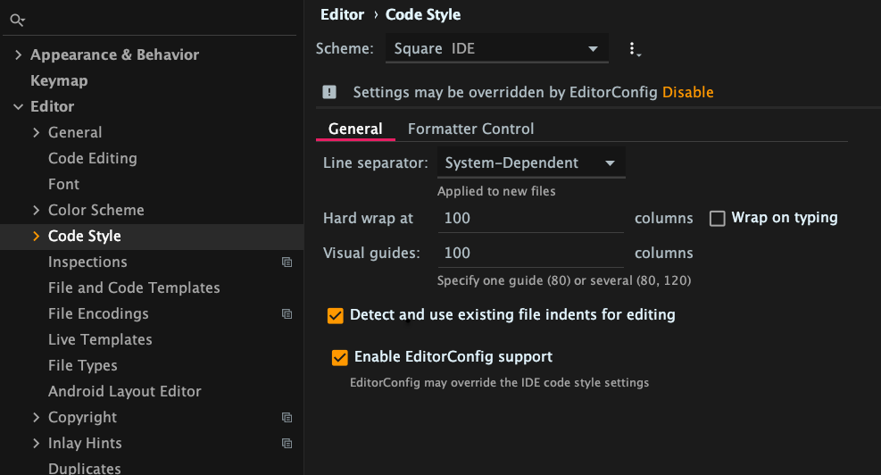

Editor Config Code Styles for IntelliJ
================

Installation
------------
We now prefer to use [editorconfig](https://editorconfig.org/) instead of code styles on the IDE. 

Copy the file `./configs/editorconfigs/SquareEditorConfig` as `.editorconfig` on to the root of your repo in order for everyone using that repo 
to use the same code styles.

And ensure that IntelliJ settings recogises `.editorconfig` files, like this. The `Enable EditorConfig Support` will be ticked by default, unless you have changed it.

Please note: `./configs/editorconfigs/SquareEditorConfig` file has been created by importing the Square code style located here `./configs/codestyles/Square.xml` into Intellij
 and using IntelliJ to export an `.editorconfig` file.

Installation (Deprecated)
------------

 * On Unix, run the `install.sh` script. Windows users should use `install.bat` instead.
 * Restart IntelliJ if it's running.
 * Open IntelliJ Project Settings -> Code Styles, change the code style for the
   project to the one you want.

License
-------

